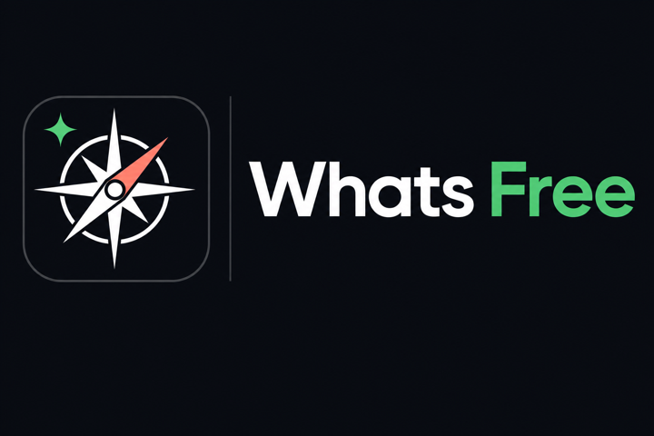

  

# Whats Free

**Languages:** English (this file) · [简体中文](README.zh-Hans.md)

> A community-maintained directory of tools and services that are **actually free**—or that still offer a **fair, usable free tier**—so you waste less time on bait-and-switch “free” offers.

  
`SPDX-License-Identifier: CC-BY-SA-4.0` — full text in [LICENSE](LICENSE).

---

## Scope & languages

This repo is **global by design**. Contributions are welcome in **any language** (English, 中文, 日本語, Español, …). For each listing, spell out clearly:

- **Official docs / pricing links**  
- **What “free” actually covers** (limits, caps, renewals)  
- **Caveats** (credit card required, region locks, edu-only, etc.)

Prefer tagging docs with a language code where helpful (`en`, `zh-Hans`, …).  
Translations and summaries here are for convenience only—**the vendor’s current terms win**. See [DISCLAIMER.md](DISCLAIMER.md).

---

## What this project does

The word “free” gets abused a lot: time-limited trials, surprise paywalls, plan downgrades you never agreed to. **Whats Free** tries to do three things:

1. **Curate** — Group picks by use case (dev, design, learning, media, cloud, …).  
2. **Be explicit** — Say when a card, school email, or region check is required, and what the quota roughly looks like.  
3. **Stay current** — PRs and issues to add entries, fix mistakes, or flag offers that changed.

No scraper marketplace, no paid courses—just a **shared checklist** you can skim or ship in your own workflows.

## Catalog (growing)

| Track | What we list |
|------|----------------|
| ☁️ Cloud & API | Free tiers, trial credits, student bundles |
| 💻 Dev & Tools | IDEs, CI, observability, managed datastores |
| 🎨 Design & Media | Assets, type, lightweight design tools · [Google Stitch](stitch/README.md) (free-tier notes, diagrams, Cursor skill) |
| 📚 Learn | Courses, docs, open curricula |
| 🔒 Security & Privacy | Password managers, 2FA, security tools with a real free tier |
| 🎮 Other | Durable free plans or unusually generous freemium |

**Layout convention:** one **top-level folder per product** (e.g. `stitch/`): a `README` explaining the free angle, optional `assets/`, and optional Cursor skills under something like `stitch-cli/SKILL.md`. Each folder is the source of truth for that entry.

## Contributing

- **New entries:** Link official docs, describe what the free tier includes, and note **when you last checked** (timezone optional but helpful).  
- **Fixes / removals:** If a vendor tightens or kills a free tier, open an issue or PR—we’d rather be wrong briefly than stale forever.  
- **Tone:** Factual beats hype; if you use affiliate or referral links, **disclose them** next to the link.  
- **Translations:** Non-English submissions welcome; when translating an existing doc, keep a clear pointer to the canonical path so we don’t fork silently.

## License

Original prose, list structure, and explanatory text in this repo (where copyright applies) is licensed under **Creative Commons Attribution-ShareAlike 4.0** ([CC BY-SA 4.0](https://creativecommons.org/licenses/by-sa/4.0/)): share and adapt with **attribution** and **share-alike** on derivatives. The full legal text is in [LICENSE](LICENSE) (verbatim CC legalcode—please don’t edit the text).

Third-party trademarks, marketing copy, and proprietary assets stay with their owners; listing them here **does not** mean this project owns those rights. Details in [DISCLAIMER.md](DISCLAIMER.md).

## Disclaimer (short)

Information is **for orientation only**; **no warranties**; not legal, tax, or investment advice. **Each provider’s live terms and website rule the day.** Full statement (EN + 简体中文) in [DISCLAIMER.md](DISCLAIMER.md).

---

If this repo saves you a dead-end signup, consider **starring** it—and send a PR when you spot another **real** free tier worth sharing.
