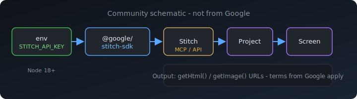

# Google Stitch · 免费说明与资源

> **最后核对日期**：请以 [Stitch 官网](https://stitch.withgoogle.com/) 及 [SDK 文档](https://stitch.withgoogle.com/docs/sdk/tutorial/) 的 **现行条款** 为准，下方仅为信息汇总。

## 这是什么？

**Stitch** 是 Google 侧的 **AI 原生设计 / 界面生成** 能力：用文字描述即可生成界面稿，并可拿到 HTML、截图等资源。开发者侧通过官方 **[@google/stitch-sdk](https://www.npmjs.com/package/@google/stitch-sdk)**（Apache-2.0）以 Node.js 调用。

## 「免费」通常指什么？

- **SDK 与 CLI 工具链**：`@google/stitch-sdk` 开源可 **免费安装使用**；不产生 npm 许可费。  
- **Stitch 产品本身**：是否有 **免费额度、试用、是否需绑卡、地域限制** 等，**完全由 Google / Stitch 产品政策决定**，且可能随时调整。  
- **API Key**：需在官方流程中申请；使用量与计费以控制台与文档为准。

**本仓库不保证** 你使用时仍享有任何免费层；使用前请自行阅读官方定价与使用条款。

## 在本仓里的内容

| 路径 | 说明 |
|------|------|
| [工作流示意图（SVG）](assets/stitch-workflow.svg) | 从 `STITCH_API_KEY`、Node、`@google/stitch-sdk` 到 Stitch API、Project、Screen、HTML/截图 URL 的关系示意（社区自制，非 Google 官方图） |
| [stitch-cli/SKILL.md](stitch-cli/SKILL.md) | **Cursor Agent Skill**：仅用官方 SDK 生成/批量改版/变体等 |

将 `stitch-cli` 目录复制到 `~/.cursor/skills/stitch-cli/`（保持内含 `SKILL.md`）即可在 Cursor 中作为 Skill 使用。

## 官方链接

- [Stitch](https://stitch.withgoogle.com/)  
- [SDK 教程](https://stitch.withgoogle.com/docs/sdk/tutorial/)  
- [stitch-sdk npm](https://www.npmjs.com/package/@google/stitch-sdk) · [源码仓库](https://github.com/google-labs-code/stitch-sdk)

## 示意图（SDK 工作流）

